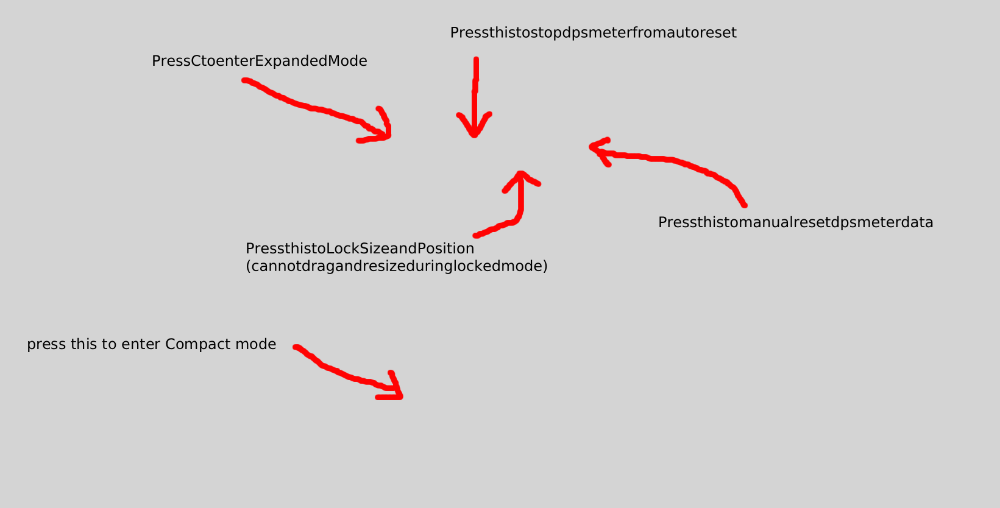

<div align="center">

# BlueMeter Lite
BlueMeter Lite is a lightweight Android combat meter for Blue Protocol: Star Resonance. It shows DPS, healing and damage received directly over the game without requiring a PC.

It is an independently maintained fork of BlueMeter Mobile, with added multi-region support, encounter history and improved reset controls.

This is an unofficial open-source community project and is not affiliated with the game’s developers or publishers.

[**Download the latest APK**](https://github.com/Zudin987/BPSR-BlueMeter-Lite/releases/latest)

</div>

> [!NOTE]
> Android shows a VPN icon while the meter is running. BlueMeter Lite uses a local VPN to read supported BPSR traffic on your phone. It does not send your combat data to a BlueMeter server.

## Quick start

1. Download the latest APK. Most modern phones should use **arm64-v8a**.
2. Install and open **BlueMeter Lite**.
3. Tap **Start DPS Meter**.
4. Allow **Display over other apps**.
5. Approve Android's VPN request.
6. Open BPSR and start fighting.

## What the overlay buttons do



| Button | What it does |
|---|---|
| **DPS / Healing / Tanking** | Changes which combat meter is shown. |
| **C** | Compact view. Uses less screen space. |
| **E** | Expanded view. Shows more player information. |
| **Grey auto-reset icon** | Automatic reset is **ON**. The meter can start a fresh encounter after a detected map or dungeon change. |
| **Orange crossed auto-reset icon** | Automatic reset is **LOCKED/OFF**. Current data stays until you press manual reset or stop the meter. |
| **Grey open lock** | The overlay can be moved and resized. |
| **Yellow closed lock** | Locks the overlay's position and size so you do not move it by accident. Other buttons still work. |
| **Reset arrow** | Manually saves and clears the current encounter. |
| **Drag the top bar** | Moves the overlay while the position lock is open. |
| **Bottom-right handle** | Resizes the overlay while the position lock is open. |

> [!IMPORTANT]
> BlueMeter Lite has **two different locks**:
>
> - **Orange auto-reset lock:** stops automatic encounter resets.
> - **Yellow padlock:** only stops the overlay from moving or resizing.

The selected meter, view mode, size, position and lock states are remembered the next time you start the overlay.

## The three meters

- **DPS** — total damage, damage per second and party contribution.
- **Healing** — total healing, healing per second and party contribution.
- **Tanking** — total damage received, damage received per second and party contribution.

## Automatic reset and encounter history

With automatic reset enabled, BlueMeter Lite starts a new encounter when it detects a supported map, channel, dungeon, wipe or boss-phase change.

Encounters are saved when:

- an automatic reset happens
- you press the manual reset button
- you stop the DPS meter

Open the main BlueMeter Lite app and tap **Encounter history** to review them. History is stored only on your phone and entries older than **7 days** are deleted automatically.

> Some unusual boss phase or wipe behaviour may not always be detected. Use the manual reset button when needed.

## What the numbers mean

Example expanded row:

```text
01. ★ Player — Frostbeam (49,632 + 2,250)   2.8M (79.9K)   23%
```

- `01` — ranking
- `★` — your character
- `Frostbeam` — detected specialization
- `49,632 + 2,250` — Ability Score + Illusion-Breaking Strength
- `2.8M` — total amount
- `79.9K` — amount per second
- `23%` — share of the group's total

The meaning of the total changes with the selected tab: damage, healing or damage received.

## Main app buttons

| Button | What it does |
|---|---|
| **Start DPS Meter** | Opens the overlay and starts local capture. |
| **Stop DPS Meter** | Stops capture, closes the overlay and saves the current encounter when data exists. |
| **Encounter history** | Opens saved encounters from the last 7 days. |
| **About and privacy** | Shows version, privacy and open-source information. |

## Supported Android clients

- HaoPlay SEA
- A Plus Japan / Global
- Taiwan / Hong Kong / Macau
- X.D. regional client

## Common problems

<details>
<summary><strong>The overlay does not appear</strong></summary>

1. Stop the meter.
2. Confirm **Display over other apps** is enabled for BlueMeter Lite.
3. Open BlueMeter Lite and press **Start DPS Meter** again.

</details>

<details>
<summary><strong>The game has no internet</strong></summary>

Stop the meter, reopen BlueMeter Lite and start it again. Also confirm the app detects your installed BPSR client.

</details>

<details>
<summary><strong>The overlay is too small or in the wrong place</strong></summary>

Tap the **open/closed padlock** until it is unlocked, then drag the top bar or use the bottom-right resize handle. Use **C** or **E** to switch between the default compact and expanded sizes.

</details>

<details>
<summary><strong>The APK will not install over v1.0.0</strong></summary>

Uninstall v1.0.0 once, then install the newer release. Versions using the permanent signing key can update normally afterward.

</details>

## Privacy

Combat information is processed locally on your Android device. BlueMeter Lite adds no user account, advertising, analytics, cloud synchronization or project-operated relay server. See [PRIVACY.md](PRIVACY.md) for details.

## Project information

<details>
<summary><strong>Building, validation and updates</strong></summary>

- [Building from source](BUILDING.md)
- [Release signing setup](SIGNING-SETUP.md)
- [Changelog](CHANGELOG.md)
- [GitHub Actions](https://github.com/Zudin987/BPSR-BlueMeter-Lite/actions)

</details>

<details>
<summary><strong>Credits and licence</strong></summary>

- Based on [BlueMeter Mobile](https://github.com/jbourny/bluemetermobile)
- Uses protocol and profession references from [BPSR-ZDPS](https://github.com/Blue-Protocol-Source/BPSR-ZDPS)
- Distributed under the [GNU AGPL-3.0 licence](LICENSE)
- See [LICENSE-NOTICE.md](LICENSE-NOTICE.md) for source-distribution requirements

Blue Protocol: Star Resonance and related names belong to their respective owners.

</details>

---

BlueMeter Lite is an unofficial community project and is not affiliated with the game's developers or publishers. Game protocol updates may require a BlueMeter Lite update.
