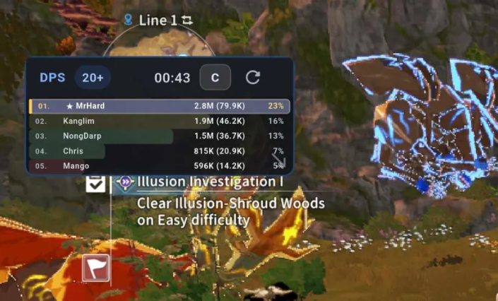
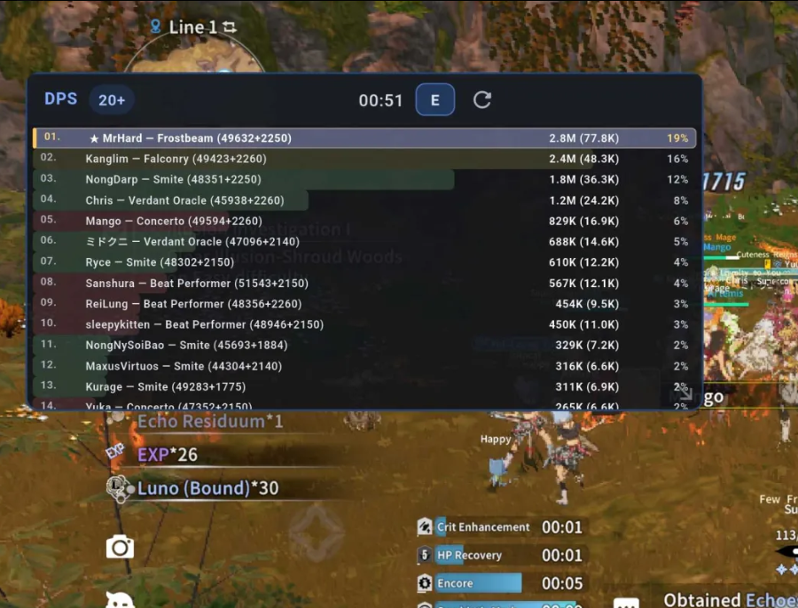

<div align="center">

# BlueMeter Lite

**by MrEz**

A lightweight Android combat meter overlay for **Blue Protocol: Star Resonance**.

No PC required. Runs directly on your Android device.

[](https://github.com/Zudin987/BPSR-BlueMeter-Lite/actions/workflows/build-apk.yml)
[](LICENSE)


[**Download the latest APK**](https://github.com/Zudin987/BPSR-BlueMeter-Lite/releases/latest)

</div>

> [!NOTE]
> Users still on v1.0.0 must uninstall it once before installing a permanently signed release. Users on v1.1.0 can update normally to v1.2.0.

## Screenshots

### Compact mode



### Expanded mode



## Features

- Toggleable **DPS**, **Healing**, and **Tanking** meters
- Damage: total damage, DPS, and group contribution percentage
- Healing: total healing, HPS, and group contribution percentage
- Tanking: total damage received, taken-per-second, and group contribution percentage
- Compact and Expanded overlay modes
- Detected profession or specialization
- Ability Score and Illusion-Breaking Strength
- Gold star and highlight for the local player
- One-column list with vertical scrolling
- Movable and manually resizable overlay
- Saved mode, size, position and lock state
- Lock button that disables both moving and resizing
- Reliable overlay recreation when Android leaves a stale overlay state
- Supported-client detection before VPN startup
- Portrait control app; the game overlay remains rotation-aware
- About screen with privacy, license and exact upstream revision
- Manual encounter reset
- Up to 20 displayed players per meter
- Android-only local capture with no PC relay

BlueMeter Lite intentionally keeps these meters lightweight. It stores only live totals and per-second values; it does not include skill breakdowns, overheal, mitigation, deaths, timelines, encounter history, target analysis, radar or boss-timer tools.

## Download and install

1. Open the [latest GitHub release](https://github.com/Zudin987/BPSR-BlueMeter-Lite/releases/latest).
2. Download the APK marked **arm64-v8a** for most modern Android phones.
3. Install the APK.
4. Open **BlueMeter Lite**.
5. Grant **Display over other apps** permission.
6. Tap **Start DPS Meter** and approve Android's VPN request.
7. Launch BPSR and enter combat.

Android displays a VPN indicator and a foreground-service notification while the meter is active.

## Overlay controls

| Control | Action |
|---|---|
| `DPS` | Rank players by total damage and DPS |
| `Healing` | Rank players by total healing and HPS |
| `Tanking` | Rank players by total damage received and taken-per-second |
| `C` | Compact mode at `180 × 80` |
| `E` | Expanded mode at `360 × 180` |
| Header drag | Move the overlay while unlocked |
| Bottom-right handle | Resize while unlocked |
| Lock icon | Lock or unlock both moving and resizing |
| Reset icon | Reset the current encounter |

The selected meter tab, mode, size, position and lock state are restored the next time the overlay starts.

## Display format

Compact:

```text
01. ★ MrHard                         2.8M (79.9K)   23%
```

Expanded:

```text
01. ★ MrHard — Frostbeam (49632+2250)   2.8M (77.8K)   19%
```

The name-side values are:

```text
Ability Score + Illusion-Breaking Strength
```

The right-side values follow the selected tab:

```text
DPS:      Total Damage (DPS)
Healing:  Total Healing (HPS)
Tanking:  Total Damage Received (Taken Per Second)
```

## Supported Android clients

| Region/client | Android package |
|---|---|
| HaoPlay SEA | `sea.haoplay.game.gp.bpsr` |
| A Plus Japan / Global | `com.bpsr.apj` |
| Taiwan / Hong Kong / Macau | `tw.haoplay.game.gp.xhgm` |
| X.D. regional client | `asia.xdg.game.gp.bpsr` |

The control app shows the detected client before startup. Only installed supported BPSR packages are added to the Android VPN allow-list.

## Privacy and network behaviour

BlueMeter Lite processes supported BPSR traffic locally on the phone and forwards it to the game's original destination. The project does not operate a relay server and does not require an account.

It adds no advertising, analytics or cloud synchronization. See [PRIVACY.md](PRIVACY.md).

## Troubleshooting

### Overlay does not appear

Stop the meter and press **Start DPS Meter** again. The app now closes any stale overlay and recreates it at a visible position. Also confirm **Display over other apps** permission is enabled.

### Game has no internet

Stop the meter, reopen BlueMeter Lite and start it again. Confirm the control app detects your BPSR client.

### APK does not install over v1.0.0

Uninstall v1.0.0 once, then install v1.1.0. This is required because v1.1.0 introduces the permanent signing identity.

### Class or scores are temporarily missing

Some information appears only after the relevant entity or combat packet is received.

## Maintenance status

BlueMeter Lite is feature-complete and provided as-is. Routine support, diagnosis and feature development are not planned. A future BPSR protocol update can prevent the meter from working.

## Building from source

Releases are built from a pinned BlueMeter Mobile revision and pinned Flutter version. See [BUILDING.md](BUILDING.md) and [SIGNING-SETUP.md](SIGNING-SETUP.md).

## Credits

- [BlueMeter Mobile](https://github.com/jbourny/bluemetermobile) by jbourny and contributors
- [BPSR-ZDPS](https://github.com/Blue-Protocol-Source/BPSR-ZDPS) for protocol, profession and attribute references
- Blue Protocol: Star Resonance and related names belong to their respective owners

This is an unofficial community project and is not affiliated with the game's developers or publishers.

## License

BlueMeter Lite is distributed under the [GNU Affero General Public License v3.0](LICENSE).

Modified APK distributions must provide complete corresponding source, including the Lite patch and exact upstream revision. See [LICENSE-NOTICE.md](LICENSE-NOTICE.md).
