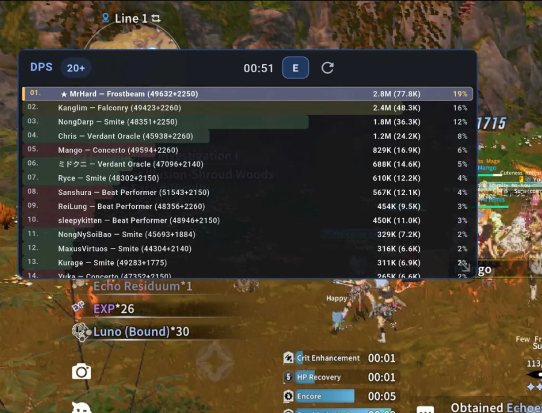

# BlueMeter Lite

Android combat meter for **Blue Protocol: Star Resonance**. View DPS, healing and damage received in a movable overlay. No PC is needed.

[Download latest APKs](https://github.com/Zudin987/BPSR-BlueMeter-Lite/releases/latest) · [Project website](https://zudin987.github.io/projects/bluemeter/) · [Report an issue](https://github.com/Zudin987/BPSR-BlueMeter-Lite/issues)

## Install and start

Choose the APK for your device:

| APK suffix | Device |
| --- | --- |
| `arm64-v8a` | Most modern Android phones |
| `armeabi-v7a` | Older 32-bit ARM devices |
| `x86_64` | Compatible emulators and x86 Android devices |

1. Download and install the APK from Releases. Allow installation from your download app if Android asks.
2. Open BlueMeter Lite and allow **Display over other apps**.
3. Tap **Start DPS Meter** and approve Android's VPN prompt.
4. Open a supported BPSR client and enter combat.
5. Move or resize the overlay; use Compact or Expanded mode as needed.

## Capture and privacy

The Android VPN is used for **local packet capture**, not a remote VPN service. Combat data stays on your device. Another VPN cannot use Android's VPN slot at the same time.

Supported client families include HaoPlay SEA, A Plus Japan/Global, Taiwan/Hong Kong/Macau and the X.D. regional client. Game/protocol updates may require a BlueMeter update.

If the overlay is missing, check the display-over-other-apps permission. If it has no data, check that capture is running, no other VPN has replaced it, and your client is supported. Include your app version, Android version and game region when reporting an issue.

## Source and credits

BlueMeter Lite is a patch kit built on [BlueMeter Mobile](https://github.com/jbourny/bluemetermobile). Releases include the corresponding patched source archive under AGPL-3.0. See [Building](BUILDING.md) for the workflow and APK architectures, and [third-party notices](THIRD-PARTY-NOTICES.md) for upstream and protocol credits.

Unofficial community tool, not affiliated with BPSR's developers or publishers.

[Privacy](PRIVACY.md) · [Changelog](CHANGELOG.md) · [License](LICENSE)
